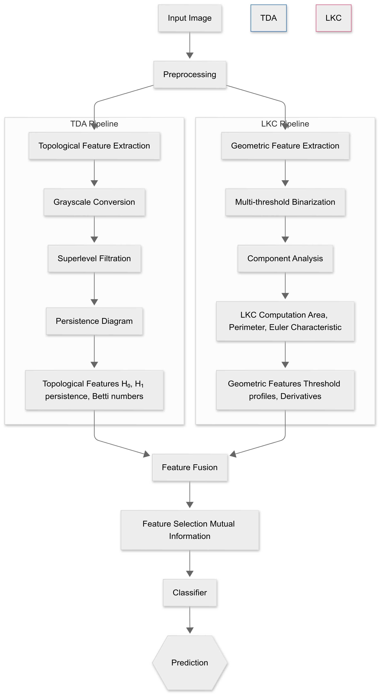

<div align="center">

# 📐 GeoTop

### Geometric-Topological Analysis for Machine Learning Image Classification

[](https://arxiv.org/abs/2311.16157)
[](https://creativecommons.org/licenses/by-nc-nd/4.0/)
[](https://choosealicense.com/licenses/gpl-3.0/)
[](https://www.python.org/)
[](https://arxiv.org/abs/2311.16157)
[](https://colab.research.google.com/github/MorillaLab/GeoTop/blob/main/GeoTop.ipynb)

**GeoTop** fuses Lipschitz-Killing Curvatures (LKCs) and Topological Data Analysis (TDA) into a unified feature extraction framework for biomedical image classification — achieving **87% accuracy** (vs. 84% single-modality) with **15–18% reduction in false positives/negatives** through synergistic geometric-topological feature fusion.

[📄 Paper](#-citation) · [🚀 Quick Start](#-quick-start) · [📊 Results](#-results) · [🏗️ Pipeline](#️-pipeline) · [🔬 Applications](#-applications)

</div>

---

## 🔍 Overview

Biomedical image classification demands features that simultaneously capture *shape*, *connectivity*, and *multi-scale structure*. Standard deep learning methods treat images as pixel grids — missing the rich geometric and topological information encoded in tissue boundaries, lesion morphology, and cellular organisation.

**GeoTop** addresses this with a dual-path architecture:

- **Topological path**: Persistent homology (TDA) extracts connectivity features — loops, voids, and connected components — that are invariant to continuous deformations
- **Geometric path**: Lipschitz-Killing Curvatures capture area, perimeter, and Euler characteristic across 200 intensity thresholds
- **Fusion**: 184 features (64 topological + 120 geometric) are combined and reduced to the top 100 by mutual information, then fed to a Random Forest ensemble

> **Key insight:** TDA and LKC are *complementary*, not redundant. TDA captures topology (is the shape simply connected?), while LKC captures geometry (how irregular is the boundary?). Their fusion resolves the topological equivalence problem — two images with identical persistent homology can still have different geometric properties, and vice versa.

<p align="center">
  
  <br/>
  <em>GeoTop dual-pipeline: topological (left) and geometric (right) feature extraction converging for ensemble classification.</em>
</p>

---

## 📊 Results

| Configuration | Accuracy | False Positive Rate | False Negative Rate |
|---|---|---|---|
| **GeoTop (TDA + LKC)** | **87%** | **↓ 15–18%** | **↓ 15–18%** |
| TDA alone | 84% | baseline | baseline |
| LKC alone | 82% | baseline | baseline |
| Processing time (224×224px) | **< 0.5s** | — | — |

Validated on skin lesion classification and plant peptide datasets (see Figures 2–5 in the [paper](https://arxiv.org/abs/2311.16157)).

---

## 🏗️ Pipeline

```
Biomedical Image (RGB or grayscale, 224×224)
          │
          ▼
   Normalization & Tumour-centric Alignment
          │
    ┌─────┴──────┐
    │            │
    ▼            ▼
TOPOLOGICAL   GEOMETRIC
  PATH          PATH
    │            │
    ▼            ▼
Grayscale    Multi-threshold
Conversion   Binarization
    │        (200 thresholds)
    ▼            │
Superlevel       ▼
Filtration   Component
    │        Analysis
    ▼            │
Persistence      ▼
Diagrams     LKC per component:
(H₀, H₁)      • Area
    │          • Perimeter
    ▼          • Euler χ
64 features      │
(Betti nums,     ▼
 entropy,    120 features
 amplitudes) (threshold
              profiles,
              derivatives,
              statistics)
    │            │
    └─────┬──────┘
          │
          ▼
   Feature Concatenation
     (184 features)
          │
          ▼
   Mutual Information
   Feature Selection
     (top 100)
          │
          ▼
   Random Forest
   (500 trees)
          │
          ▼
   Classification 🎯
```

### Topological Path — TDA

Starting from a grayscale image, GeoTop constructs a **superlevel filtration**: a nested sequence of binary images sweeping from highest to lowest intensity. Persistent homology tracks the birth and death of:
- **H₀** (connected components) — structure and connectivity
- **H₁** (loops) — holes and cyclic patterns

This yields 64 descriptors: Betti numbers, persistence entropy, and diagram amplitudes.

### Geometric Path — LKC

200 threshold-specific binary images are generated. For each, GeoTop identifies connected components and computes three Lipschitz-Killing Curvatures:
- **Area** — white pixel count (occupation density)
- **Perimeter** — boundary complexity via the Hermine-Agnes algorithm
- **Euler Characteristic** — #Components − #Holes (topological invariant)

This yields 120 descriptors: threshold profiles, first and second derivatives, and summary statistics.

### Clinical Interpretability

GeoTop features map directly to diagnostic criteria:
- Perimeter → **margin irregularity**
- Euler characteristic → **lesion connectivity**
- Persistence entropy → **structural heterogeneity**

---

## 🔬 Applications

GeoTop has been validated on and applied within:

| Application | Dataset | Key result |
|---|---|---|
| Skin lesion classification | Biomedical images | 87% accuracy |
| Plant peptide analysis | Protein embedding images | Used in [S2-PEPANALYST](https://github.com/MorillaLab/s2-PEPANALYST) |
| Protein function annotation | Embedding-as-image | Scale-invariant functional domain detection |
| General biomedical multiomics | Various | Improved over single-modality baselines |

GeoTop is also the accuracy assessment backbone of **[S2-PEPANALYST](https://github.com/MorillaLab/s2-PEPANALYST)** (Abaach *et al.*, 2023, cited in *Plant Biotechnology Journal*).

---

## 🚀 Quick Start

### Installation

```bash
git clone https://github.com/MorillaLab/GeoTop.git
cd GeoTop
pip install -r requirements.txt
```

### Run the main notebook

```bash
jupyter notebook GeoTop.ipynb
```

Or launch in Colab:

[](https://colab.research.google.com/github/MorillaLab/GeoTop/blob/main/GeoTop.ipynb)

### Python API

```python
from Code.geotop import GeoTop

# Initialise with both pipelines
model = GeoTop(n_topo_features=64, n_lkc_features=120, n_select=100)

# Fit on training images
model.fit(X_train_images, y_train)

# Predict
predictions = model.predict(X_test_images)

# Inspect extracted features
topo_feats = model.topological_features(X_test_images)   # shape (N, 64)
geom_feats = model.geometric_features(X_test_images)     # shape (N, 120)
```

### Run tests

```bash
pytest tests/ -v --tb=short
```

---

## 📁 Repository Structure

```
GeoTop/
├── Code/                       # Core library: TDA, LKC, fusion, classification
├── Images/                     # Figures and workflow diagrams
│   ├── augmented_images.png    # Data augmentation examples
│   └── ML_workflow_GeoTop.png  # Main pipeline figure
├── tests/                      # Unit tests
├── training/                   # Training scripts and configs
├── weights/                    # Pre-trained model weights
├── .github/workflows/          # CI/CD pipeline
├── GeoTop.ipynb                # Main analysis notebook
├── requirements.txt            # Python dependencies
└── LICENSE                     # GPL-3.0
```

---

## 🎈 Citation

If you use GeoTop in your research, please cite:

```bibtex
@misc{abaach2023geotopadvancingimageclassification,
  title         = {GeoTop: Advancing Image Classification with
                   Geometric-Topological Analysis},
  author        = {Abaach, Mariem and Morilla, Ian},
  year          = {2023},
  eprint        = {2311.16157},
  archivePrefix = {arXiv},
  primaryClass  = {cs.CV},
  url           = {https://arxiv.org/abs/2311.16157}
}
```

---

## 🔗 Related MorillaLab Repositories

GeoTop is a foundational component used across the lab's projects:

- **[TaelCore](https://github.com/MorillaLab/Taelcore)** — uses GeoTop's topological accuracy assessment for dimensionality reduction
- **[S2-PEPANALYST](https://github.com/MorillaLab/s2-PEPANALYST)** — uses GeoTop for plant signalling peptide classification
- **[TopoAttention](https://github.com/MorillaLab/TopoAttention)** — topological features for lung transplant mortality prediction

---

## 🤝 Contributing

We welcome contributions — new geometric descriptors, faster filtration algorithms, new application domains. Please open an issue before submitting a pull request. See [`CONTRIBUTING.md`](CONTRIBUTING.md) for guidelines.

---

## 📜 License

- **Code**: GNU General Public License v3.0 — see [`LICENSE`](LICENSE)
- **Paper / figures**: CC BY-NC-ND 4.0

> **Note:** The Colab badge in the original README linked to `TopoTransformers` (a different repo) — corrected here to point to `GeoTop.ipynb`.

---

<div align="center">
  Made with ❤️ by <a href="https://github.com/MorillaLab">MorillaLab</a>
  <br/>
  <sub>Abaach · Morilla · arXiv:2311.16157</sub>
</div>
